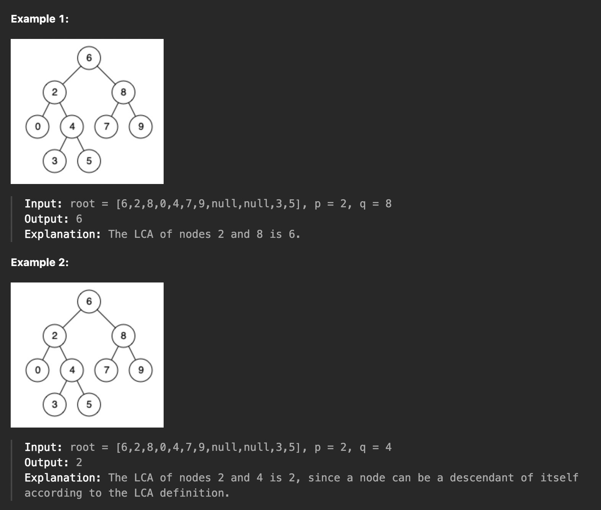

## LCA in Binary Search Tree




```swift
func lowestCommonAncestor(_ root: TreeNode?, _ p: TreeNode?, _ q: TreeNode?) -> TreeNode? {
    
    if root == nil {
        return root
    }
    
    var rooData = root
    
    var rootVal = root?.val ?? 0
    
    if rootVal > p!.val &&  rootVal > q!.val {
        return lowestCommonAncestor(root?.left, p, q)
    } 
    
    if rootVal < p!.val &&  rootVal < q!.val {
        return lowestCommonAncestor(root?.right, p, q)
    } 

    return root
    
}

```