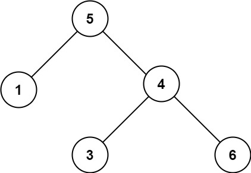
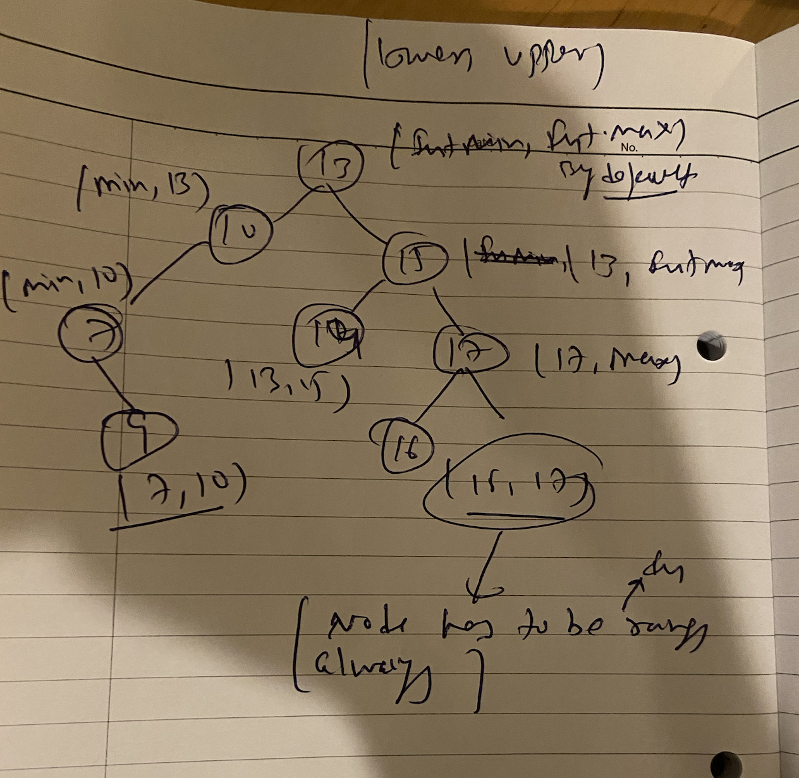

## 98. Validate Binary Search Tree






```swift
    func isValidBST(_ root: TreeNode?) -> Bool {
        return isBST(root, lower: Int.min, upper: Int.max)
    }

    func isBST(_ root: TreeNode?, lower: Int, upper: Int) -> Bool {
    
    guard let root = root else {return true} 

    if root.val >= upper || root.val <= lower {
        return false
    }
    
    return isBST(root.left, lower: lower, upper: root.val) && 
        isBST(root.right, lower: root.val, upper: upper)
}
```