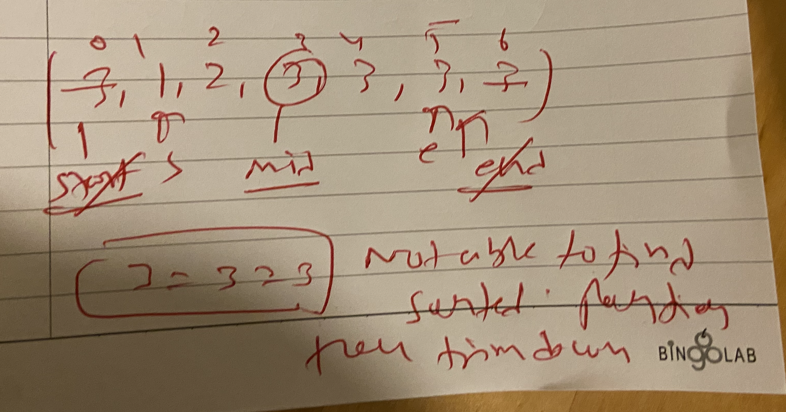

## Search Element in a Rotated Sorted Array

```markdown
Example 1:
Input Format: arr = [4,5,6,7,0,1,2,3], k = 0
Result: 4
Explanation: Here, the target is 0. We can see that 0 is present in the given rotated sorted array, nums. Thus, we get output as 4, which is the index at which 0 is present in the array.
```


simple one 

>> find out sorted part of the array

```swift
func elementInSortedAndRotatedArray(_ nums: [Int], target: Int) {
    var start = 0
    var end = nums.count - 1
    
    while( start <= end) {
        let mid =  ( start + end ) / 2
        if nums[mid] == target {
            return mid
        }
        
        //check for left one is sorted or not
        if nums[start] <= nums[mid] {
            if nums[start] <= target && nums[mid-1] >= target {
                // now element lies b/w left sorted part only
                end = mid - 1
            } else {
                start = mid + 1
            }
        } else { //right portion is sorted then
            
            if nums[mid+1] <= target && nums[end] >= target {
                start = mid + 1
            } else {
                end = mid - 1
            }
        }
    }
    return -1
}

```

for recursive approach please check this sloution 

https://leetcode.com/problems/search-in-rotated-sorted-array/


## Search Element in Rotated Sorted Array II


```swift
Example 1:
Input Format: arr = [7, 8, 1, 2, 3, 3, 3, 4, 5, 6], k = 3
Result: True
Explanation: The element 3 is present in the array. So, the answer is True.

```

if array having duplicates then we can use above method but it will get fail for this case 

arr = 3,1,2,3,3,3,3

in this we cant make decision means we cant eleminte or check sorted part in this we have `trim down` our problem 

```swift
if arr[mid] == arr[start] && arr[mid] == arr[end] {
    start = start + 1
    end = end - 1
    continue;
}
```

