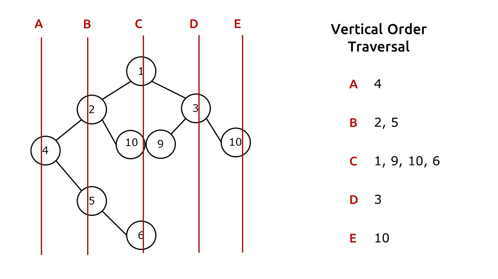
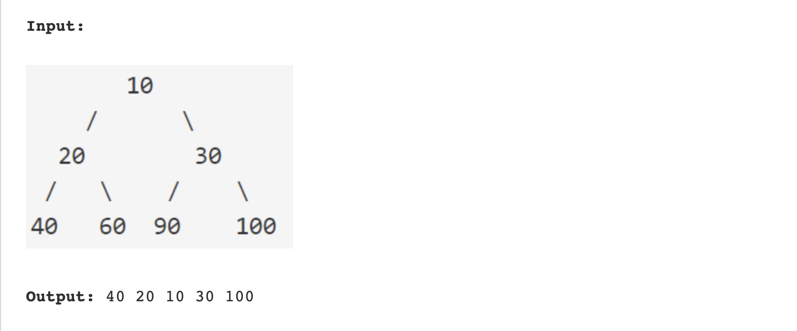
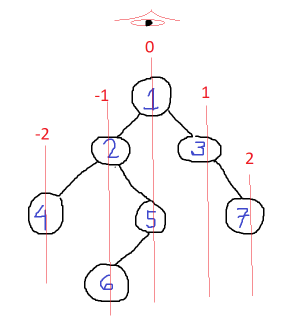
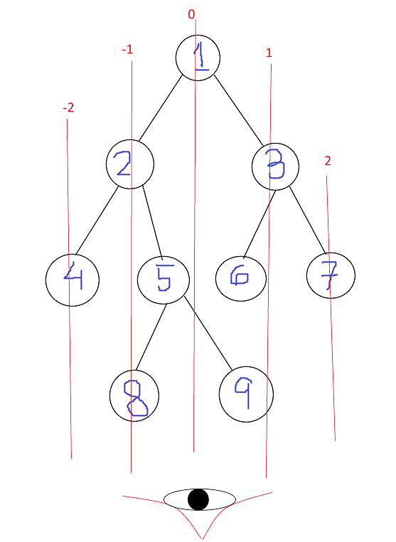

## Vertical Order Traversal of Binary Tree

https://www.youtube.com/watch?v=PQKkr036wRc&ab_channel=VivekanandKhyade-AlgorithmEveryDay




```markdown
its not perfect one we have to take more deepeer means two level hash map 

//[hd: [level : [data]]]

this current solution only hold 
//[hd: [data]]

but it get confuse with 10, 9 (its has to come as sorted but current will not left to right )
```

```swift
func isArrEmptyNodeData(_ arr: [[NodeData]]) -> Bool {
    let main = arr.count
    let first = arr.first?.count
    if first == 0 {
        return true
    }
    return false
}

struct NodeData {
    var node: TreeNode
    var hd: Int
}

func levelOrderVertical(_ root: TreeNode?) -> [[Int]] {
    
    var dict = [Int: [Int]]()

    var ans = [[Int]]()
    var arr = [[NodeData]]()
    
    if root == nil {
        return ans
    }
    
    arr.append([NodeData.init(node: root!, hd: 0)])
    
    while (!isArrEmptyNodeData(arr)) {
        let first = arr.removeFirst()
        var temp = [NodeData]()
        var tempData = [Int]()
        
        for ele in first {
            if let left = ele.node.left {
                temp.append(NodeData(node: left, hd: ele.hd - 1))
            }
            if let right = ele.node.right {
                temp.append(NodeData(node: right, hd: ele.hd + 1))
            }
            
            if let exist = dict[ele.hd] {
                dict[ele.hd] = exist + [ele.node.val]
            } else {
                dict[ele.hd] = [ele.node.val]
            }
        }
        arr.append(temp)
        ans.append(tempData)
    }
    print(dict)
    
    return ans
}

```


## Top view of a Binary Tree



```markdown
    if let exist = dict[ele.hd] {
        dict[ele.hd] = exist + [ele.node.val]
    } else {
        dict[ele.hd] = [ele.node.val]
    }
```
change this to hold only one value means top value so will not store antoher value 

```markdown
    --- change to this ----
    if dict[ele.hd] == nil {
        dict[ele.hd] = [ele.node.val]
    }
```




## Bottom view of a Binary Tree




4 8 6 9 7


```markdown
    if let exist = dict[ele.hd] {
        dict[ele.hd] = exist + [ele.node.val]
    } else {
        dict[ele.hd] = [ele.node.val]
    }
```
change this to hold only one value means lastest value will used only or menas last value will used bcz that only will be visisble from bottom


```markdown
    --- change to this ----
        dict[ele.hd] = [ele.node.val]
```
