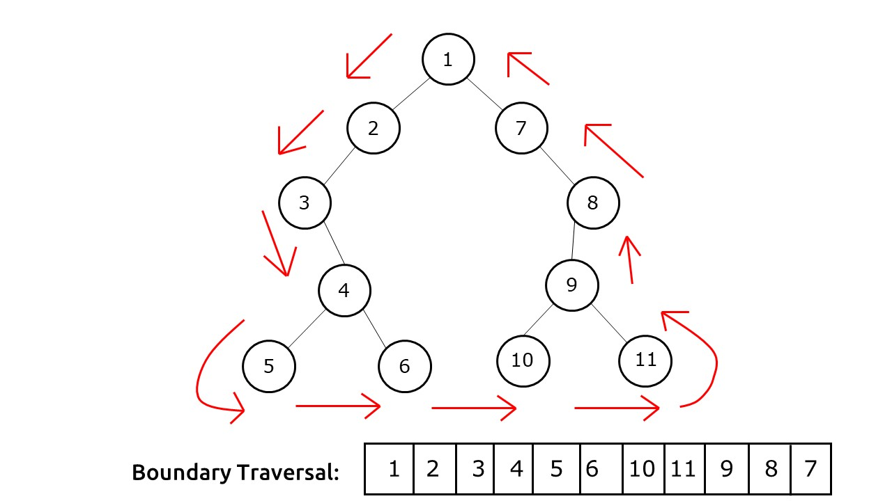

## Boundary Traversal of a Binary Tree




```markdown
using preOrders traversing
1. first take left side node except leaves
2. then take right side node except leaves and root 
3. revers 2nd step data and merge into 1st one
4. now traverse all leaf node in preOrders
```

```swift
func isLeafNode(_ node: TreeNode?) -> Bool {
    if node?.left == nil && node?.right == nil {
        return true
    }
    return false
}

func outSideLeftTraversal(_ root: TreeNode?, arr: inout [Int]) {
    if root == nil {
        return
    }
    if !isLeafNode(root) {
        arr.append(root?.val ?? 0)
    }
    if root?.left == nil {
        outSideLeftTraversal(root?.right, arr: &arr)
    }
    outSideLeftTraversal(root?.left, arr: &arr)
}

func outSideRightTraversal(_ root: TreeNode?, arr: inout [Int]) {
    if root == nil {
        return
    }
    if !isLeafNode(root) {
        arr.append(root?.val ?? 0)
    }
    if root?.right == nil {
        outSideRightTraversal(root?.left, arr: &arr)
    }
    outSideRightTraversal(root?.right, arr: &arr)
}

func countLeafNode(_ root: TreeNode?, arr: inout [Int]) {
    if root == nil {
        return
    }
    if isLeafNode(root) {
        arr.append(root?.val ?? 0)
    }

    countLeafNode(root?.left, arr: &arr)
    countLeafNode(root?.right, arr: &arr)
}

```