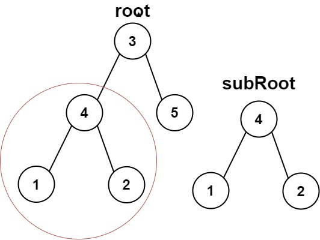

## check if a tree is subtree of another tree

https://www.youtube.com/watch?v=73PQ9raLEVs&ab_channel=VivekanandKhyade-AlgorithmEveryDay



for this true


```swift
func isSame(_ tree1: TreeNode?, tree2: TreeNode?) -> Bool {
    
    if tree1 == nil && tree2 == nil {
        return true
    }

    if tree1 == nil || tree2 == nil {
        return false
    }
    
    let val1 = tree1?.val ?? 0
    let val2 = tree2?.val ?? 0
    
    return (val1 == val2) && isSame(tree1?.left, tree2: tree2?.left) && isSame(tree1?.right, tree2: tree2?.right)
}

func isSubTreeOrNot(_ tree1: TreeNode?, tree2: TreeNode?) -> Bool {
    
    if tree2 == nil {
        return true
    }
    
    if tree1 == nil {
        return false
    }
    
    if isSame(tree1, tree2: tree2) {
        return true
    }
    
    return isSubTreeOrNot(tree1?.left, tree2: tree2) || isSubTreeOrNot(tree1?.right, tree2: tree2)
}

print(isSubTreeOrNot(root, tree2: root2))

```