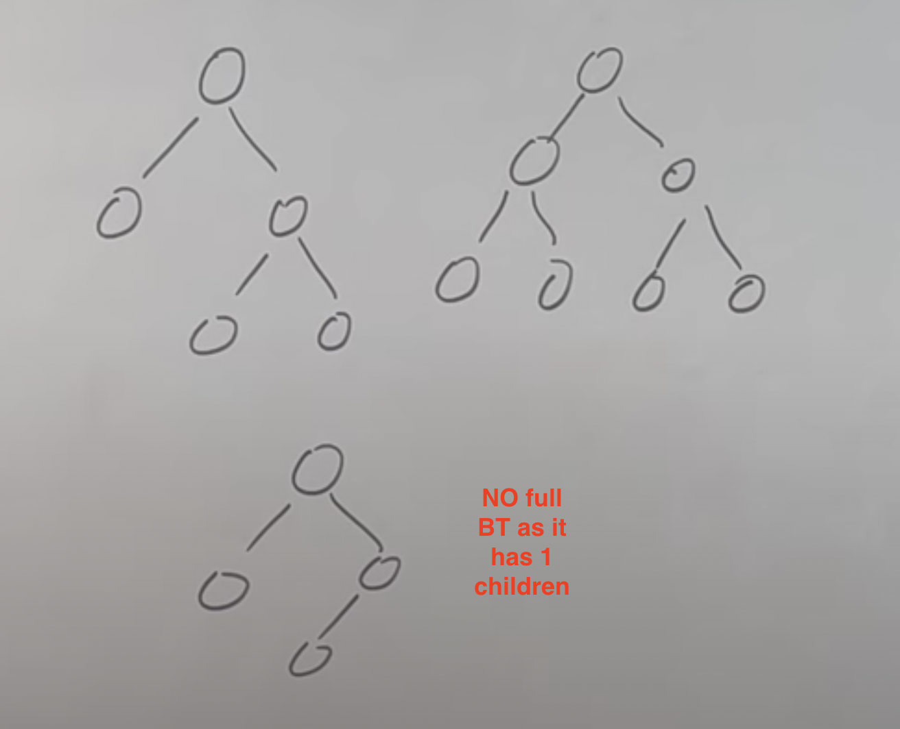

A tree data structure is a hierarchical structure that is used to represent and organize data in a way that is easy to navigate and search.   
 It is a collection of nodes that are connected by edges and has a hierarchical relationship between the nodes. 


## type of binary Tree

1. Full BT
2. complete BT
3. Perfect BT
4. Balanced BT
5. Degenerate Tree


## 1. Full BT
- either has 0 or 2 childrens



## 2. Complete BT

- all levels are filled 
- last level has all node as much as possibl from left


```markdown
 level1           0 
                /   \
 level2        0     0 
             /   \  /  \
 level3     0     0 0   0 
```


   ```markdown
          0 
        /   \
       0     0 
     /   \  / 
    0     0 0    
   ```

```markdown
     not complet BT
          0 
        /   \
       0     0 
     /   \     \ 
    0     0     0 
```


## 3. pefect BT

- all leaf nodes should be on same level

```markdown
          0 
        /   \
       0     0 
     /   \     \ 
    0     0     0 
```

```markdown
not possible
          0 
        /   \
       0     0 
     /   \     
    0     0     
```


## 4. blanced BT

- hieght of tree at max `logN` : n is number of nodes

n = 8 then max heiht should be 3 (log8)


## 5. degenerate BT

look like linked list (left squeked)


```markdown
          0 
        /   
       0     
     /        
    0       
```
