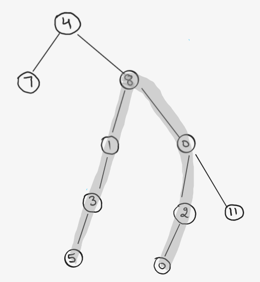
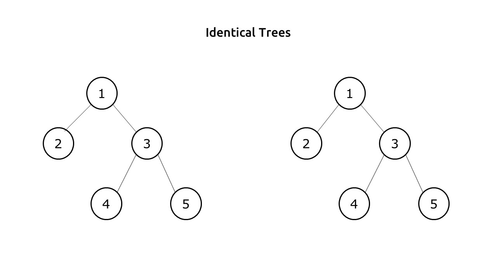

## Calculate the Diameter of a Binary Tree



ans = 6

```swift
var diamter = 0

func diameter(_ tree: TreeNode?, diamter: inout Int) -> Int {
    if tree == nil {
        return 0
    }
    
    let lh = diameter(tree?.left, diamter: &diamter)
    let rh = diameter(tree?.right, diamter: &diamter)
    
    diamter = max(diamter, lh+rh)
    
    return 1 + max(lh, rh)
}
```


## Check if two trees are identical




```swift
func isSame(_ root1: TreeNode?, root2: TreeNode?) -> Bool {
    
    if root1 == nil && root2 == nil {
        return true
    }
    
    if root1 == nil || root2 == nil {
        return false
    }
    
    let val1 = root1?.val ?? 0
    let val2 = root2?.val ?? 0
    
    return (val1 == val2) && isSame(root1?.left, root2: root2?.left) && isSame(root1?.right, root2: root2?.right)

}

```
