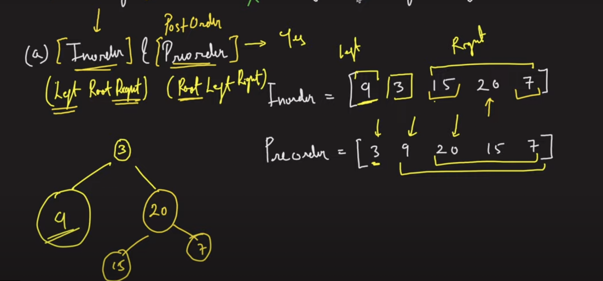
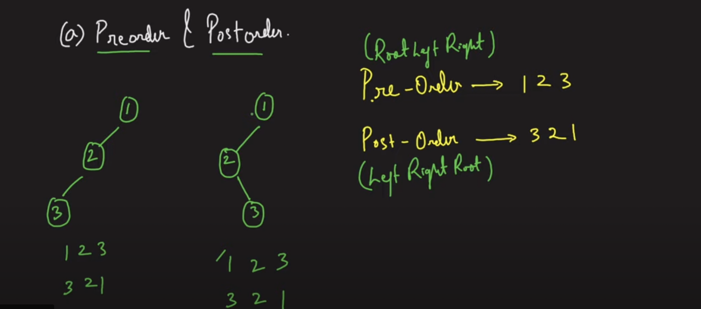

## Requirements needed to construct a Unique Binary Tree


- cant create unique BT with postOrder and InOrderOrder traversal
- bcz with these we have multiple possiblities

to contrsuct unique BT we will use Preorder with post/In order traversal.






```swift
func buildBTMain(_ preOrder: [Int], inOrder: [Int]) -> TreeNode?  {
    var dict = [Int: Int]()
    
    for index in 0..<inOrder.count {
        dict[inOrder[index]] = index
    }
    print(dict)
    
   return buildBT(preOrder, startPre: 0, endPre: preOrder.count - 1, inOrder: inOrder, startIn: 0, endIN: inOrder.count - 1, dict: dict)    
    
}

func buildBT(_ preOrder: [Int], startPre: Int, endPre: Int,  inOrder: [Int], startIn: Int, endIN: Int, dict: [Int: Int]) -> TreeNode? {
    
    if startPre > endPre || startIn > endIN {
        return  nil
    }
        
    let node = TreeNode(preOrder[startPre])
    guard let rootIndex = dict[preOrder[startPre]] else {return nil} 
    
    let length = rootIndex - startIn
    
    node.left = buildBT(preOrder, startPre: startPre + 1, endPre: startPre + length, inOrder: inOrder, startIn: startIn, endIN: rootIndex - 1, dict: dict)
    
    node.right = buildBT(preOrder, startPre: startPre + length + 1, endPre: endPre, inOrder: inOrder, startIn: rootIndex + 1, endIN: endIN, dict: dict)
    
    return node

}


```