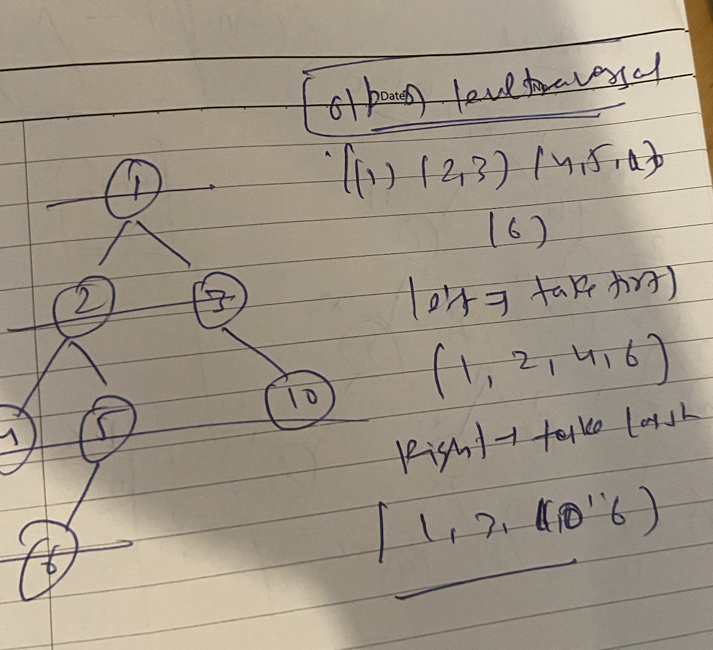
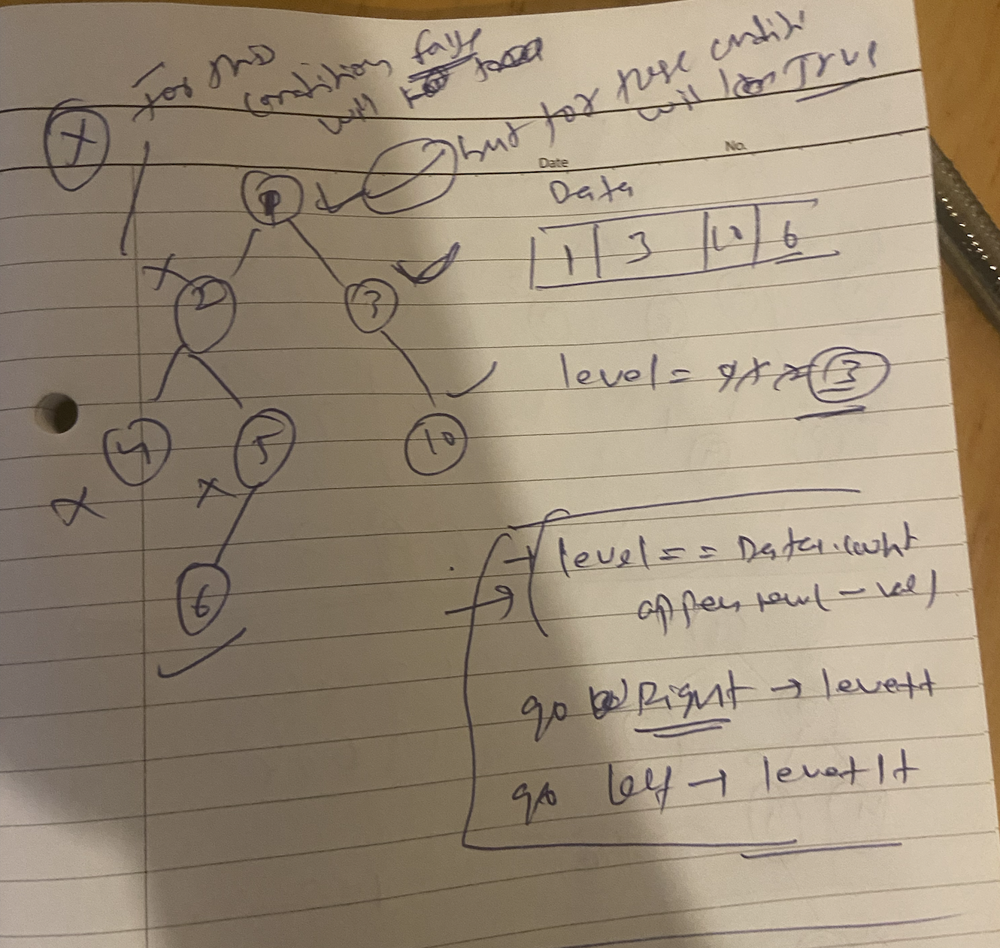

## Right/Left view of binary tree


## 1. Sloutoion 
do level traversal and take values from array accoding to traversal means
- for left take first 
- for right take last one from each array




```markdown
left o/p = [1,2,4,6]
right o/p = [1,3,10,6]
```

## 2. Sloution 
can use recusion simple

```swift
var leftViewArr = [Int]()

func rightViewOfTree(_ root: TreeNode?, level: Int,  data: inout [Int]) {
    
    if root == nil {
        return 
    }
    if level == data.count {
        data.append(root?.val ?? 0)
    }
    rightViewOfTree(root?.right, level: level + 1, data: &data)
    rightViewOfTree(root?.left, level: level + 1, data: &data)
}

```

