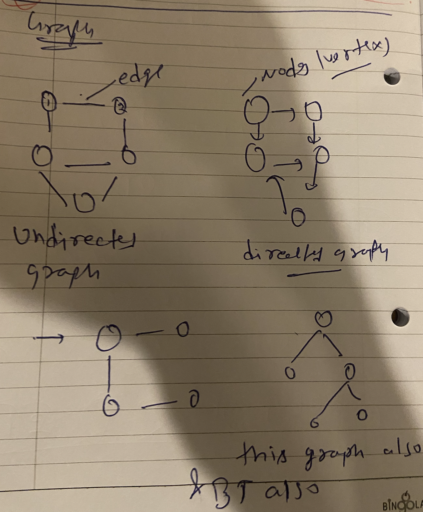
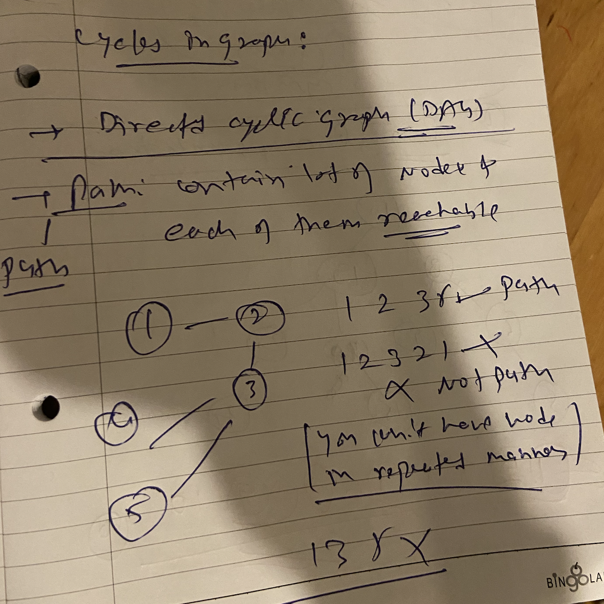
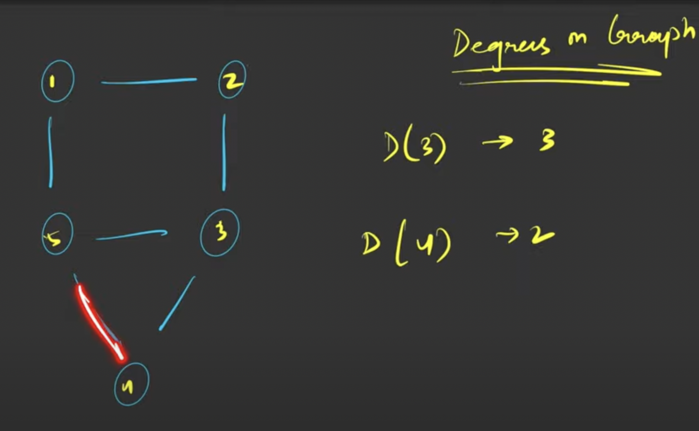

## Graphs


## Type of Graph 

```markdown
Directed graph
Undirected Graph
```


## if graph as cycle then
-- Directed with cycle - cylic Directed graph
-- Directed with w/o cycle - acylic Directed grpah (DAG)


## Cylce of Graphs




## Degree Of Graph



```markdown
Total Degree of Graph = 2 * E (E: edge)
```
> In directed graph there will be indirected and outdireced degreee (means incoming and outgoing edges respectively)


## Visting 

-> We have to maintain visited array to maintain traversal
so that we can mark once its visited


