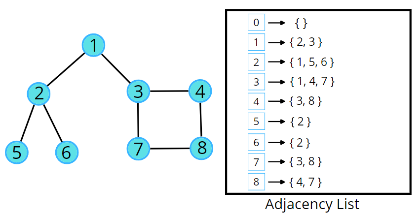

## BFS 
## Breadth First Search (BFS): Level Order Traversal


```swift
// adjcency list representation for graph
var adj = [Int: [Int]]()

// its 1-indexed graph
adj[1] = [2,6]
adj[2] = [3,4]
adj[3] = [2]
adj[4] = [2,5]
adj[5] = [4,7]
adj[6] = [1,7,8]
adj[7] = [5,6]
adj[8] = [6]


var visited = Array(repeating: 0, count: 9)
var arr = [6] // starting node

while (!arr.isEmpty) {
    let ele = arr.removeFirst()
    
    for next in adj[ele] ?? [] {
        if visited[next] != 1 {
            visited[ele] = 1
            arr.append(next)
        }
    }
}

```

```markdown
Time Complexity: O(N) + O(2E), Where N = Nodes, 2E is for total degrees as we traverse all adjacent nodes.
```


## DFS 
## Depth First Search (DFS)

It will depth first, adn there are multiple possiblties of final path



```swift
var adjNew = [Int: [Int]]()
adjNew[1] = [2,3]
adjNew[2] = [1,5,6]
adjNew[3] = [1,4,7]
adjNew[4] = [3,8]
adjNew[5] = [2]
adjNew[6] = [2]
adjNew[7] = [3,8]
adjNew[8] = [7,4]

var visited = Array(repeating: 0, count: 9)

func dfs(_ node: Int) {
    print("visiting node \(node)")
    visited[node] = 1
    for n in adjNew[node] ?? [] {
        if visited[n] == 0 {
            dfs(n)
        }
    }
}

dfs(1)

print(visited)

```

```markdown
Time Complexity: For an undirected graph, O(N) + O(2E), For a directed graph, O(N) + O(E), Because for every node we are calling the recursive function once, the time taken is O(N) and 2E is for total degrees as we traverse for all adjacent nodes.

2E = total degree or total edags 
```
