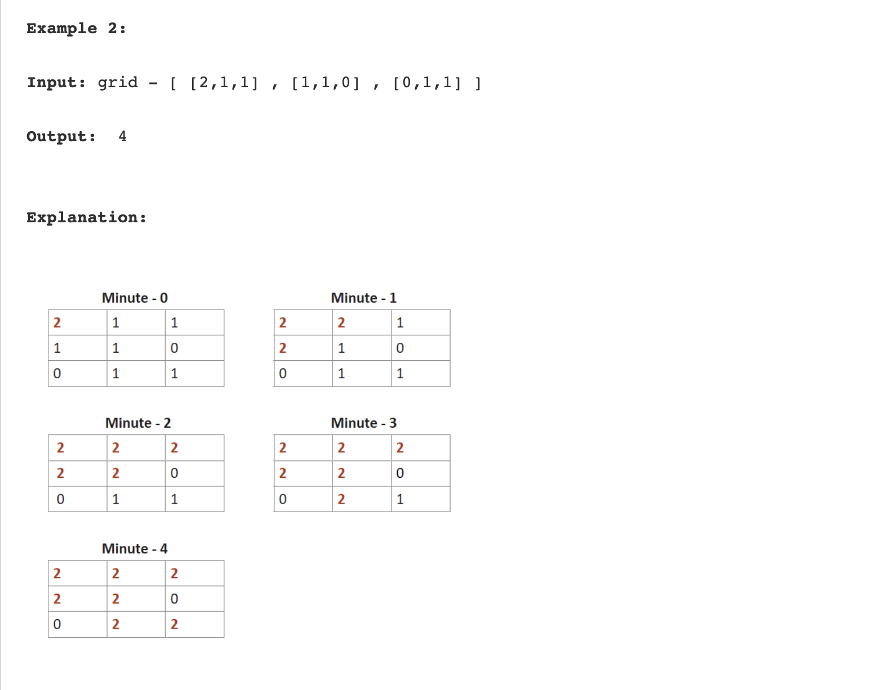

## Rotten Oranges : Min time to rot all oranges : BFS



```swift
struct Data {
    var start: Int
    var end: Int
    var time: Int
}

func findRottenOrange(_ places: [[Int]]) -> Int {
    let row = places.count 
    let col = places[0].count 
    var initalData = [Data]()
    var timeElasped = 0
    
    var vistedArr = places 
    
    for i in 0..<row {
        for j in 0..<col {
            if places[i][j] == 2 {
                initalData.append(Data(start: i, end: j, time: 0))
                vistedArr[i][j] = 2
            }
        }
    }
    print(initalData)
    print(vistedArr)
    
    while ( !initalData.isEmpty) {
        print("initalData \(initalData)")
        let first = initalData.removeFirst()
        
        // four cases 
        // to reduce this logic please have look for fllodFill problme with help rowChanges and colChanges
        
        if first.start + 1 < row {
            if vistedArr[first.start + 1][first.end] != 2 {
                vistedArr[first.start + 1][first.end] = 2
                initalData.append(Data(start: first.start + 1, end: first.end, time: first.time + 1))
            }
        }
        
        if first.end + 1 < col {
            if vistedArr[first.start][first.end + 1] != 2 {
                vistedArr[first.start][first.end + 1] = 2
                initalData.append(Data(start: first.start , end: first.end + 1, time: first.time + 1))
            }
        }
        
        if first.end - 1 >= 0 {
            if vistedArr[first.start][first.end - 1] != 2 {
                vistedArr[first.start][first.end - 1] = 2
                initalData.append(Data(start: first.start, end: first.end - 1, time: first.time + 1))
            }
        }

        if first.start - 1 >= 0 {
            if vistedArr[first.start - 1][first.end ] != 2 {
                vistedArr[first.start - 1][first.end] = 2
                initalData.append(Data(start: first.start - 1, end: first.end, time: first.time + 1))
            }
        }

        timeElasped = first.time
    }
    
    for i in 0..<row {
        for j in 0..<col {
            if vistedArr[i][j] == 1 {
                return -1
            }
        }
    }
  
    return timeElasped
    
}

```