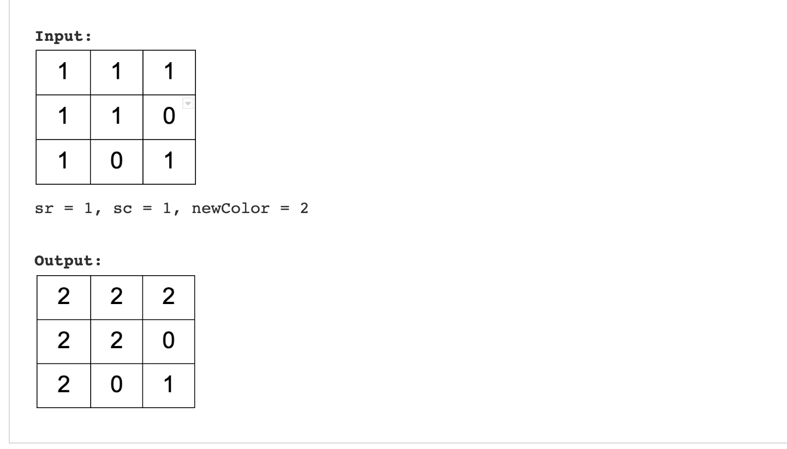

## 5. Flood Fill Algorithm – Graphs



```swift
struct DataImage {
    var start: Int
    var end: Int
}

func floodFill(_ image: [[Int]], _ sr: Int, _ sc: Int, _ color: Int) -> [[Int]] {
    
    if image[sr][sc] == color {
        return image
    }
    
    let row = image.count 
    let col = image[0].count 

    var startColor = image[sr][sc]
    var endColor = color
    
    var vistedArr = image 
    var initalData = [DataImage]()
    vistedArr[sr][sc] = endColor
    initalData.append(DataImage(start: sr, end: sc))
    
    let rowsChange = [-1, 0, 1, 0]
    let colChange = [0, 1, 0, -1]

    while ( !initalData.isEmpty) {
        //print("initalData \(initalData)")
        let first = initalData.removeFirst()
        
        for i in 0..<rowsChange.count {
            let newRow = first.start + rowsChange[i]
            let newCol = first.end + colChange[i]
            
            if newRow < 0 || newRow >= row || newCol < 0 || newCol >= col {
                continue
            }
            
            if vistedArr[newRow][newCol] != startColor {
                continue
            }
            vistedArr[newRow][newCol] = endColor
            initalData.append(DataImage(start: newRow, end: newCol))
        }
    }
    return vistedArr
}

```