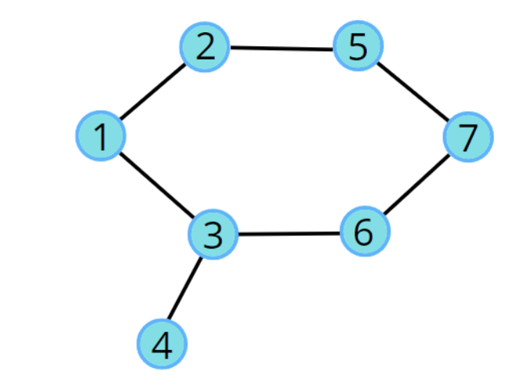

## Detect Cycle in an Undirected Graph (using BFS)


var adjDetect = [Int: [Int]]()
adjDetect[1] = [2,3]
adjDetect[2] = [1,5,6]
adjDetect[3] = [1,4,7]
adjDetect[4] = [3]
adjDetect[5] = [2]
adjDetect[6] = [2]
adjDetect[7] = [3,8]
adjDetect[8] = [7]


//var adjDetect = [Int: [Int]]()
//adjDetect[1] = [2,3]
//adjDetect[2] = [1,5]
//adjDetect[3] = [1,4,7]
//adjDetect[4] = [3]
//adjDetect[5] = [2, 7]
//adjDetect[6] = [3, 7]
//adjDetect[7] = [5, 6 ]
with cycle



//var adjDetect = [Int: [Int]]()
//adjDetect[1] = [2]
//adjDetect[2] = [1,3]
//adjDetect[3] = [2]
//adjDetect[4] = [5,6]
//adjDetect[5] = [4,6]
//adjDetect[6] = [4,5]
//adjDetect[7] = [8]
//adjDetect[8] = [7]


```swift
func bfsDetect(_ visit: inout [Int], node: Int) -> Bool {
    
    var data = [(Int, Int)]()
    data.append((node, -1))
    visit[node] = 1
    
    while ( !data.isEmpty ) {
        let first = data.removeFirst()
        let node = first.0
        let parent = first.1
        
        for ele in adjDetect[node] ?? [] {
            if visit[ele] != 1 {
                visit[ele] = 1
                data.append((ele, node))
            } else if parent != ele {
                print("Got it cycle")
                return true
            }
        }
    }
    
    return false
}

func detectCycle() {
    var visited  = Array(repeating: 0, count: 9)    
    for i in 0..<visited.count {
        if visited[i] != 1 {
            if bfsDetect(&visited, node: i) {
                break
            }
        }
    }
    print(visited)
}

```

## Detect Cycle in an Undirected Graph (using DFS)

same above example we can use


```swift
func dfsDetectCycle(_ visit: inout [Int], node: Int, parent: Int) -> Bool {
    print("node and parrent == \(node) \(parent)")
    visit[node] = 1
    //print(visit)
    for ele in adjDetect[node] ?? [] {
        if visit[ele] != 1 {
            dfsDetectCycle(&visit, node: ele, parent: node)
        } else if parent != ele {
            return true
        }
    }
    return false
}


func callGraph() {
    var visited = Array(repeating: 0, count: 9)
    
    for i in 0..<visited.count {
        if visited[i] != 1 {
            if dfsDetectCycle(&visited, node: i, parent: -1) == true {
                print("got it cycle")
                break
            }
        }
    }
    
}

callGraph()

```


```markdown
O(N + 2E) + O(N)

dfs/bfs time + outer loop for componet and this loop is not running in multiple forms bcz total it will run for N times that's why
```