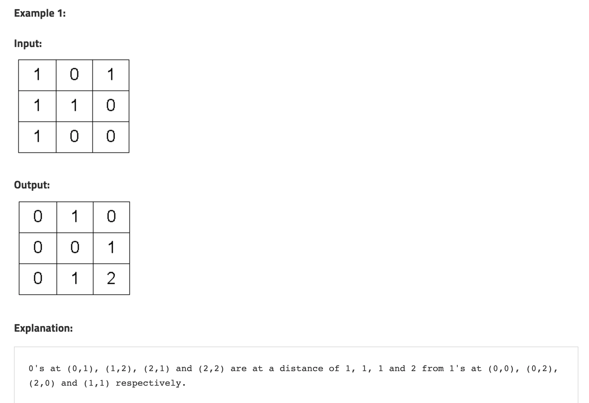

## Distance of Nearest Cell having 1





-  never change visited array expect 0 or 1 means visted to not visted

- here we are usign distance metrics to store distance results


```swift
func nearestCellToOne(_ data: [[Int]]) {
    // never change visited array expect 0 or 1 means visted to not visted
    var tracker = [NearestCell]()
    let row = data.count 
    let col = data[0].count 

    var visited = Array(repeating: Array(repeating: 0, count: col), count: row)
    
    var distance = Array(repeating: Array(repeating: 0, count: col), count: row)
    
    for i in 0..<row {
        for j in 0..<col {
            visited[i][j] = 0
            if data[i][j] == 1 {
                tracker.append(NearestCell(start: i, end: j, distance: 0))
                visited[i][j] = 1
            }
        }
    }
    let rowChange = [1, -1, 0, 0]
    let colChange = [0, 0, 1, -1]  
    
    print(visited)

    while (!tracker.isEmpty) {
        let node = tracker.removeFirst()
        distance[node.start][node.end] = node.distance

        for change in 0..<4 {
            let newRow = node.start + rowChange[change]
            let newCol = node.end + colChange[change]
            
            if newRow < 0 ||  newRow >= row || newCol < 0 || newCol >= col {
                continue
            }
            
            if visited[newRow][newCol] == 1 {
                continue
            }
            visited[newRow][newCol] = 1
            tracker.append(NearestCell(start: newRow, end: newCol, distance: node.distance + 1))
        }
    }
    print(distance)
    print(visited)
    
}

struct NearestCell {
    let start: Int
    let end: Int
    let distance: Int
}

```