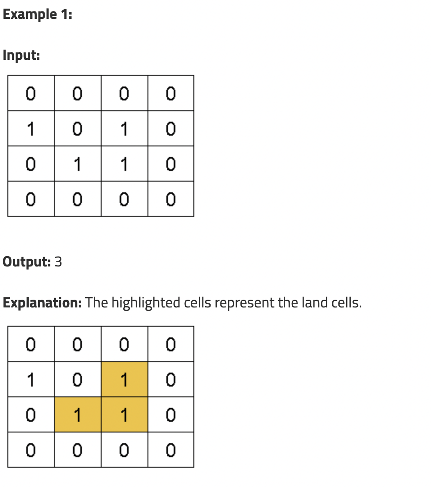
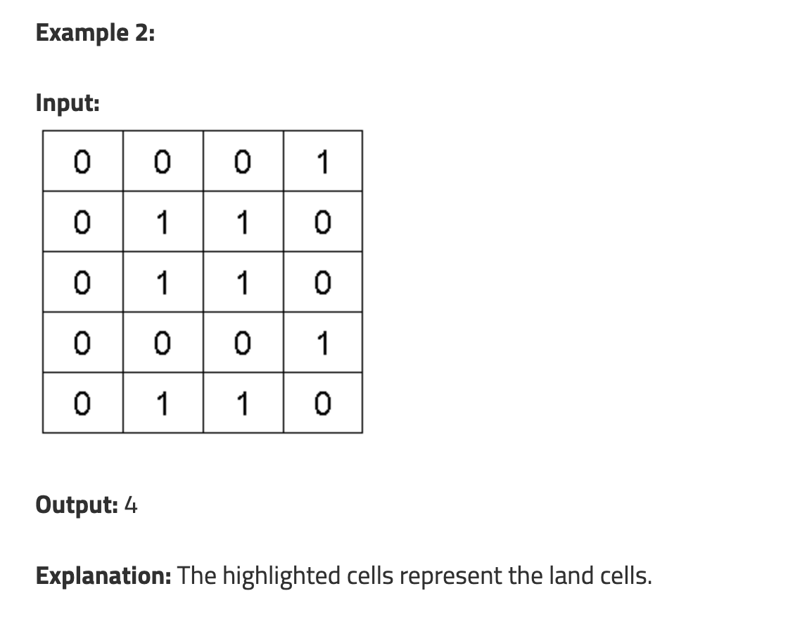

## Number of Enclaves


Problem Statement: You are given an N x M binary matrix grid, where 0 represents a sea cell and 1 represents a land cell. A move consists of walking from one land cell to another adjacent (4-directionally) land cell or walking off the boundary of the grid. Find the number of land cells in the grid for which we cannot walk off the boundary of the grid in any number of moves.







```markdown
intitution : 
1. first we will visit borders only 
2. top --> bottom --> left --> right 
3. later will check if visited arrays 1 with actual data
4. count all remaing one
```

```swift
struct Enclave {
    var start: Int
    var end: Int
}

func dfsEnclaves(_ visited: inout [[Int]], node: Enclave, grid: [[Int]]) {
    
    visited[node.start][node.end] = 1
    var data = [node]
    let row = grid.count 
    let col = grid[0].count

    let rowChange = [1, -1, 0, 0]
    let colChange = [0, 0, 1, -1]  
    
    while( !data.isEmpty ) {
        let first = data.removeFirst()
        for change in 0..<4 {
            let newRow = first.start + rowChange[change]
            let newCol = first.end + colChange[change]
            
            if newRow < 0 ||  newRow >= row || newCol < 0 || newCol >= col {
                continue
            }
            if visited[newRow][newCol] == 1 {
                continue
            }
            if grid[newRow][newCol] == 0 {
                continue
            }
            visited[newRow][newCol] = 1
            data.append(Enclave(start: newRow, end: newCol))
        }
    }
}

func numEnclaves(_ grid: [[Int]]) -> Int {
    
    let row = grid.count 
    let col = grid[0].count
    
    //print(grid)
   // print("row and col \(row) \(col)")
   var visited = Array(repeating: Array(repeating: 0, count: col), count: row)
    //print(visited)
    
    // for top row and bottom
    for i in 0..<col {
        if grid[0][i] == 1 && visited[0][i] != 1 {
            dfsEnclaves(&visited, node: Enclave.init(start: 0, end: i), grid: grid)
        }
        if grid[row-1][i] == 1 && visited[row-1][i] != 1  {
            dfsEnclaves(&visited, node: Enclave.init(start: row-1, end: i), grid: grid)
        }
    }
    
    
    // for left row and right
    for i in 0..<row {
        if grid[i][0] == 1  && visited[i][0] != 1{
            dfsEnclaves(&visited, node: Enclave.init(start: i, end: 0), grid: grid)
        }
        if grid[i][col-1] == 1 && visited[i][col-1] != 1 {
            dfsEnclaves(&visited, node: Enclave.init(start: i, end: col-1), grid: grid)
        }
    }
    var ans = 0
    for i in 0..<row {
        for j in 0..<col {
            if grid[i][j] == 1 && visited[i][j] != 1 {
                ans += 1
            }
        }
    }
    return ans
        
}

```


```markdown
//numEnclaves([[0,0,0,0],[1,0,1,0],[0,1,1,0],[0,0,0,0]])

//numEnclaves([[0,0,1,1,1,0,1,1,1,0,1],[1,1,1,1,0,1,0,1,1,0,0],[0,1,0,1,1,0,0,0,0,1,0],[1,0,1,1,1,1,1,0,0,0,1],[0,0,1,0,1,1,0,0,1,0,0],[1,0,0,1,1,1,0,0,0,1,1],[0,1,0,1,1,0,0,0,1,0,0],[0,1,1,0,1,0,1,1,1,0,0],[1,1,0,1,1,1,0,0,0,0,0],[1,0,1,1,0,0,0,1,0,0,1]])

numEnclaves([[0],[1],[1],[0],[0]])

```