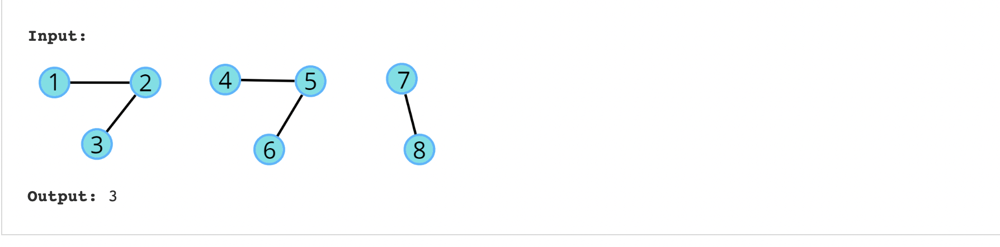

##  Number of Provinces




```swift
func convertMatrixToList(_ mat: [[Int]]) ->  [Int: [Int]] {
    var adjMat = [Int: [Int]]()
    let row = mat.count 
    let col = mat[0].count 
    
    for i in 0..<row {
        for j in 0..<col {
            if mat[i][j] == 1 {
                if let exist = adjMat[i] {
                    adjMat[i] = exist + [j]
                } else {
                    adjMat[i] = [j]
                }
            }
        }
    }
   //print(adjMat)
   return adjMat

}

func dfsWithAdj(_ node: Int, adj: [Int: [Int]], visited: inout [Int]) {
    visited[node] = 1
    for n in adj[node] ?? [] {
        if visited[n] == 0 {
            dfsWithAdj(n, adj: adj, visited: &visited)
        }
    }
}


func findCircleNum(_ isConnected: [[Int]]) -> Int {
    var adj = [Int: [Int]]()
    
    adj = convertMatrixToList(isConnected)
    var visted = Array(repeating: 0, count: isConnected.count)
    var ans = 0
    
    for index in 0..<isConnected.count {
        if visted[index] == 0 {
            ans += 1
            dfsWithAdj(index, adj: adj, visited: &visted)
        }
    }
  
    return ans
}

```