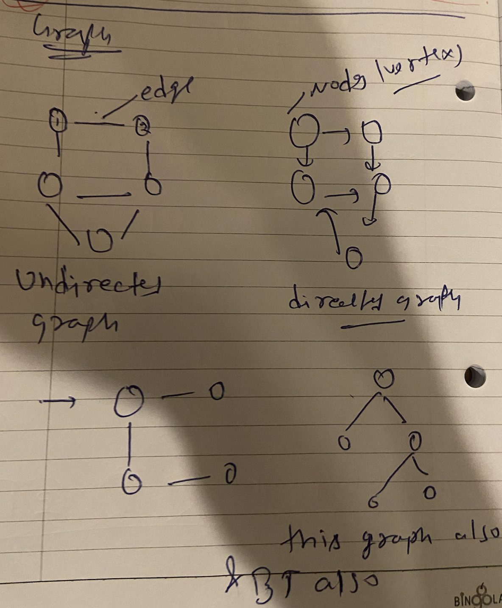
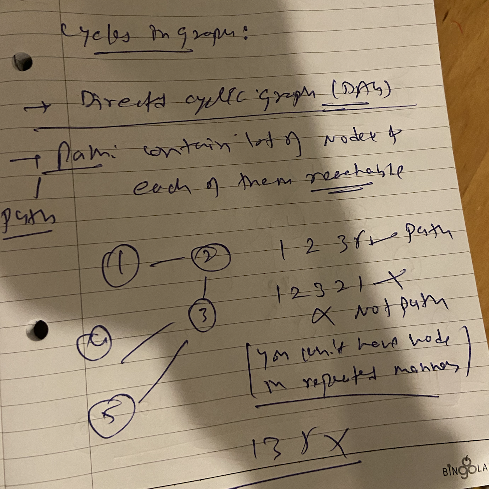
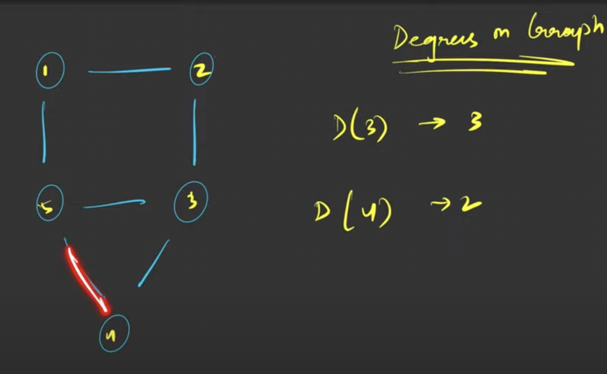

## graphs


## type of graph 

```markdown
directed graph
undirected Graph
```



## cylce of graphs




## Degree Of graph



```markdown
total degree of graph = 2 * E (E: edge)
```
> in directed graph there will be indirected and outdireced degreee (means incoming and outgoing edges respectively)


## visting 

-> we have to maintain visited array to maintain traversal
so that we can mark once its visited


