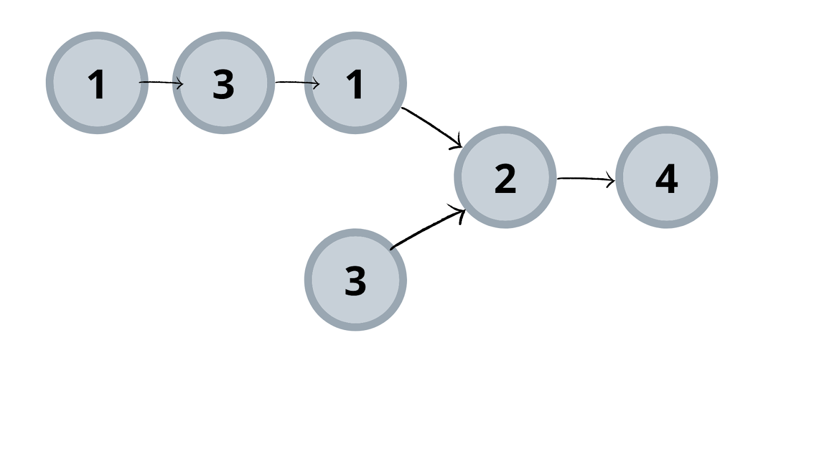
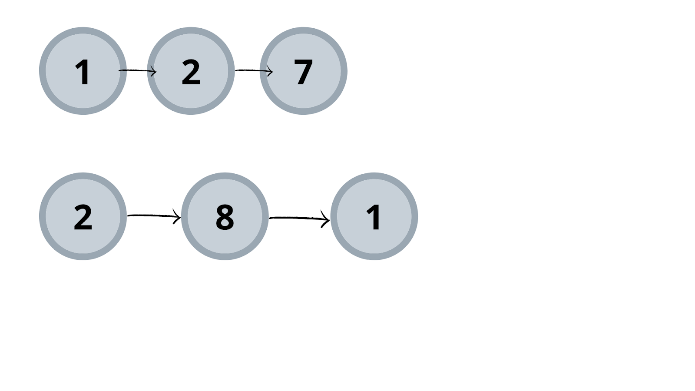

## Find intersection of Two Linked Lists


## used Node class 

>> here we are using === to compare objects direclty 

```swift
class Node: Hashable {
    
    static func == (lhs: Node, rhs: Node) -> Bool {
        lhs === rhs
    }
    
    func hash(into hasher: inout Hasher) {
        hasher.combine(ObjectIdentifier(self))
    }
    
    let value: Int
    var next: Node?
    
    init(value: Int, next: Node?) {
        self.value = value
        self.next = next
    }
    
    init (value: Int) {
        self.value = value
        self.next = nil
    }
}

```

Example 1:

Input:
List 1 = [1,3,1,2,4], List 2 = [3,2,4]

Output:
2

Explanation: 
Here, both lists intersecting nodes start from node 2.



Example 2:

Input:
 List1 = [1,2,7], List 2 = [2,8,1]

Output:
 Null

Explanation: Here, both lists do not intersect and thus no intersection node is present.




### Brute force : 

compare one by one element from one linked list to another linked list like array,

Complexity : O(n*m)

### Hashing:

Store data from list to hashmap and then traverse another list via checking stored hasmap


```swift
    func findIntersection(_ head1: Node?, head2: Node?) {
        if head1 == nil || head2 == nil {
            print("not found")
            return
        }
        var visitedLLData = Set<Node>()
        var temp = head1
        while ( temp != nil ){
            print(temp?.value ?? 0)
            if let temp {
                visitedLLData.insert(temp)
            }
            temp = temp?.next
        }
        
        print(visitedLLData)
        
        temp = head2
        var found = false
        
        while ( temp != nil ) {
            print(temp?.value ?? 0)
            if let temp {
                if visitedLLData.contains(temp) {
                    found = true
                    break
                }
            }
            temp = temp?.next
        }
        
        if found {
            print("found intersection")
        } else {
            print("not found intersection")
        }
    }

```

## better hashing 

```swift
    func findIntersectionBetter(_ head1: Node?, head2: Node?) {
        // If either list is empty, there can't be an intersection
        guard let _ = head1, let _ = head2 else {
            print("No intersection: One or both lists are empty.")
            return
        }

        var mutableHead1 = head1
        var mutableHead2 = head2
        
        // Use a set to store visited nodes from both lists
        var visitedNodes = Set<Node>()
        
        // Traverse both lists until you reach the end of both
        while mutableHead1 != nil || mutableHead2 != nil {
            
            // Check head1 if it hasn't reached the end
            if let node1 = mutableHead1 {
                if visitedNodes.contains(node1) {
                    print("Intersection found at node with value: \(node1.value)")
                    return
                }
                visitedNodes.insert(node1)
                mutableHead1 = node1.next
            }
            
            // Check head2 if it hasn't reached the end
            if let node2 = mutableHead2 {
                if visitedNodes.contains(node2) {
                    print("Intersection found at node with value: \(node2.value)")
                    return
                }
                visitedNodes.insert(node2)
                mutableHead2 = node2.next
            }
        }

        // If no intersection is found after traversing both lists
        print("No intersection found")
    }

```

## with two pointers 

```swift
    func withTwoPointers(_ head1: Node?, head2: Node?)  {
        // If either list is empty, there can't be an intersection
        guard let _ = head1, let _ = head2 else {
            print("No intersection: One or both lists are empty.")
            return
        }

        var p1 = head1
        var p2 = head2
        
        while ( p1 != p2 ){
            p1 = p1 == nil ? head2 : p1?.next
            p2 = p2 == nil ? head1 : p2?.next
        }
        
        if let p1 {
            print("intersection found at \(p1.value)")
        } else {
            print("no intersection found")
        }
    }

```


###  dummy Data  

```swift
    func createIntersectionLinkedList() {
//        let head1 = Node(value: 1)
//        
//        head1.next = Node(value: 3)
//        head1.next?.next = Node(value: 1)
//        
//        let head2 = Node(value: 3)
//        let intersection = Node(value: 2)
//        
//        head2.next = intersection
//        
//        head1.next?.next?.next = intersection
//        head1.next?.next?.next?.next = Node(value: 4)        
        let head1 = Node(value: 1)
        head1.next = Node(value: 2)
        head1.next?.next = Node(value: 3)
        
        let head2 = Node(value: 1)
        head2.next = Node(value: 2)
        head2.next?.next = Node(value: 3)
        head2.next?.next?.next = Node(value: 7)
        head2.next?.next?.next?.next = Node(value: 8)
        findIntersection(head1, head2: head2)
    }

```

## why we can't use struct 

```swift
struct NodeStruct {
    let value: Int
    var next: NodeStruct? // error: Value type 'NodeStruct' cannot have a stored property that recursively contains it
}
```

```markdown
Value Types (struct)
Stored directly: Value types are stored directly in memory. When you create a struct, Swift needs to know the exact size of the struct at compile time.
Recursion problem: If you define a struct with a property that references another instance of the same type (like a linked list node with a next pointer), Swift tries to allocate memory for that property within the struct. This leads to an infinite recursive size calculation because each instance would contain another instance, and so on.
Resulting error: This is why you get the error Value type 'NodeStruct' cannot have a stored property that recursively contains it. Swift can't compute the size of a value type that references itself.
Reference Types (class)
Stored as a reference: Reference types, on the other hand, are stored as pointers to memory locations, not as actual instances directly in the memory layout of the object. When you create a class instance, the properties hold references (pointers) to other objects, not the objects themselves.
No recursion problem: Since a class holds references to its instances, the memory doesn't have to hold the actual object inside it. The size of a reference (or pointer) is always known (usually a fixed size, like 8 bytes on 64-bit systems), so Swift can handle recursion easily by storing references without needing to allocate infinite space.

```