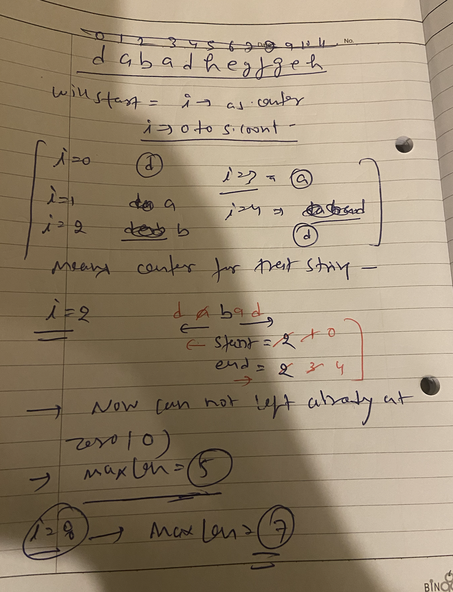

## 5. Longest Palindromic Substring

```markdown
Example 1:
Input: s = "babad"
Output: "bab"
Explanation: "aba" is also a valid answer.
Example 2:
Input: s = "cbbd"
Output: "bb"

```

## 647. Palindromic Substrings

```markdown
Example 1:
Input: s = "abc"
Output: 3
Explanation: Three palindromic strings: "a", "b", "c".

Example 2:
Input: s = "aaa"
Output: 6
Explanation: Six palindromic strings: "a", "a", "a", "aa", "aa", "aaa".

```


## approach 

1. we will consider each letter as center of plaindrome string 
2. will move pointer from that center one for left and one right 
3. where ever chars will not match will stop and will take max length
4. wil do this process for even and odd separately 





```swift

var counter = 0
func countSubstrings(_ s: String) -> Int {
    var arrS = Array(s)
    var start = 0
    var maxLen = 0
    
    for index in 0..<arrS.count {
        checkFor(index, end: index, maxLen: &maxLen, arr: arrS, startOfSubS: &start)
        checkFor(index, end: index + 1, maxLen: &maxLen, arr: arrS, startOfSubS: &start)

    }
    return counter
}

func checkFor(_ start: Int, end: Int, maxLen: inout Int, arr: [Character], startOfSubS: inout Int) {
    var end = end
    var start = start
    while start >= 0 && end < arr.count && arr[start] == arr[end]  {
        start -= 1
        end += 1
        counter += 1
    }
    start += 1
    end -= 1 
    if end - start + 1 > maxLen {
        maxLen = end - start + 1
        startOfSubS = start
    }    
}
```