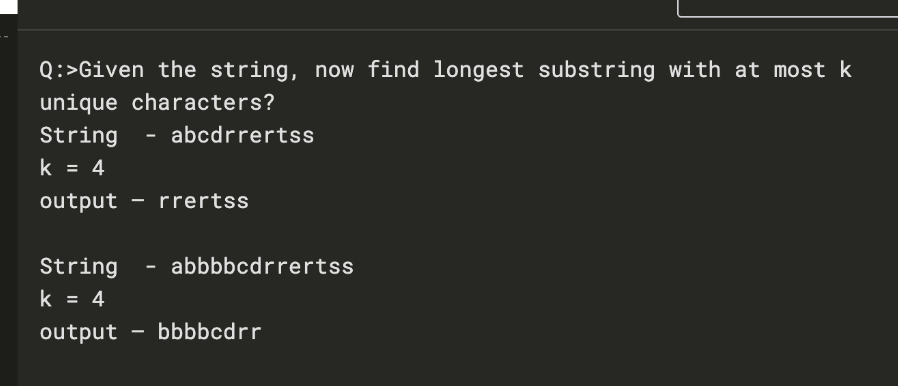

## Given the string not find the longest substring with at most k unique characters?




```swift
    func stringWithUniqueKChar(_ s: String, k: Int) {
        // inital
        var charPostionHolder = [Character: Int]()
        var startIndex = 0
        var len = 0
        var arr = [Character]()
        
        // execution
        for index in 0..<s.count {
            let charAtIndex = s[s.index(s.startIndex, offsetBy: index)]

            if arr.count == k && charPostionHolder[charAtIndex] == nil {
                let droppingChar = arr.removeFirst()
                let beforePoistion = charPostionHolder[droppingChar] ?? 0
                if len < (index - startIndex) {
                    len = index - startIndex
                    print("Current leng = \(len) \(Array(s)[startIndex...index-1])")
                }
                startIndex = beforePoistion + 1
                charPostionHolder[charAtIndex] = nil
            } else {
                if !arr.contains(charAtIndex) {
                    arr.append(charAtIndex)
                }
            }
            
            charPostionHolder[charAtIndex] = index
        }
        
        if len < (s.count - startIndex) && arr.count <= k {
            len = s.count - startIndex
            print("Current leng = \(len) \(Array(s)[startIndex...s.count - 1])")
        }
    }

```