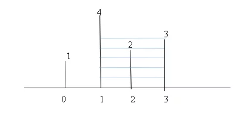

## Container with most water


Problem Statement:  Given an integer array height of length n. There are n vertical lines drawn such that the two endpoints of the ith line are (i, 0) and (i, height[i]). Find two lines that together with the x-axis form a container, such that the container contains the most water. Return the maximum amount of water a container can store.




```markdown
in this pictuer i = 1 and j = 3 
so total filled water will be like this === (j-i) * min (arr[j], arr[i]) 
== (3 - 1) * min(4,3) = 2*3 = 6
```

## 1 brute force 
with two loops   
will check for every container with others  

```swift
func bruteForceForMaxWater(_ arr: [Int]) {
    var maxWater = 0
    
    for i in 0..<arr.count {
        for j in i+1..<arr.count {
            let currentWater = (j-i) * min(arr[i], arr[j]) // main formula
            maxWater = max(maxWater, currentWater)
        }
    }
    print(maxWater)
}
```

## 2. two pointer approach 

using two pointer 
and taking decision on current value of that containers

```swift
func optimizedVersion(_ arr: [Int]) {
    // will do with pointers 
    var maxWater = 0
    var left = 0
    var right = arr.count - 1
    while left < right {
        let currentWater = (right-left) * min(arr[left], arr[right])
        maxWater = max(maxWater, currentWater)
        if arr[left] > arr[right] {
            right -= 1 
        } else {
            left += 1
        }
    }
}

```
