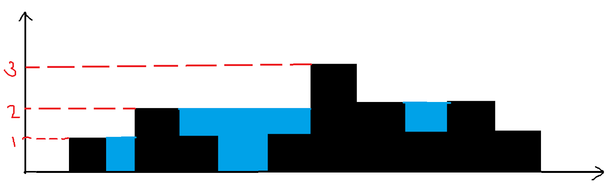

## Trapping Rainwater

### Problem Statement: Given an array of non-negative integers representation elevation of ground. Your task is to find the water that can be trapped after rain.



```markdown
Input: height= [0,1,0,2,1,0,1,3,2,1,2,1]
Output: 6
Explanation: As seen from the diagram 1+1+2+1+1=6 unit of water can be trapped
```

## 1.soution with prefix and suffix sum 

we are using suffix and prefix sum array to calculate data 


```swift
func trap(_ height: [Int]) -> Int {
    
    if height.count <= 2 {
        return 0
    }
    
    var prefixMax = Array(repeating: 0, count: height.count)
    var suffixMax = Array(repeating: 0, count: height.count)
    
    var last = height.count - 1

    for index in 0..<height.count {
        
        if index == 0 {
            prefixMax[index] = height[index]
        } else {
            prefixMax[index] = max(height[index], prefixMax[index-1])
        }
        if last ==  height.count - 1 {
            suffixMax[last] = height[last]
        } else {
            suffixMax[last] = max(height[last], suffixMax[last+1])
        }
        last -= 1 
    }
    
    var count = 0
    
    for index in 0..<height.count {
        let currentValue = min(prefixMax[index], suffixMax[index])
        count += abs(currentValue - height[index])
    }
    
    return count
}


```

## 2. sloutions:  with two pointers 

https://leetcode.com/problems/trapping-rain-water/